# 1. Product introduction

**KS0190 keyestudio Environment Monitoring Kit**

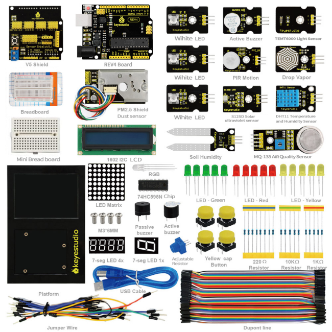

## 1.1 Kit Introduction

keyestudio Environment Monitoring Kit,the latest environmental study kit, greatly lowers the difficulty in program learning for enthusiasts. All computer language and professional grammars of a program can be simplified into blocks. Compiling is as easy as block building. Interactive with Arduino development board, they can achieve exciting works.

The open source feature of Arduino makes it extremely popular. You can find a many learning communities on the Internet. Ardublock is a programming environment, just like blocks building, which greatly lowers the learning difficulty for starters. As long as you love it, everyone can play with Arduino without professional knowledge or relevant background. As for parents who stress on the education of next generation, this will be one of your best way to interact with your children.

## 1.2 Kit List

| No.  | Product Name                         | Quantity | Picture              |
| ---- | ------------------------------------ | -------- | -------------------- |
| 1    | KEYESTUDIO REV4 Control Board        | 1        |  |
| 2    | V5 Shield                            | 1        | 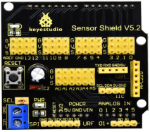 |
| 3    | Piranha LED Module                   | 3        | 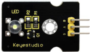 |
| 4    | Active Buzzer Module                 | 1        | 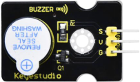 |
| 5    | Ambient Light Sensor                 | 1        | 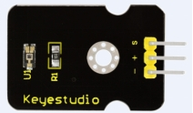 |
| 6    | PIR Motion Sensor                    | 1        | 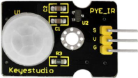 |
| 7    | Vapor Sensor                         | 1        | 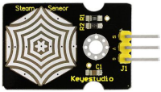 |
| 8    | Ultraviolet Sensor                   | 1        | 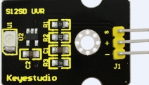 |
| 9    | DHT11Temperature and Humidity Sensor | 1        | 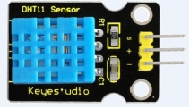 |
| 10   | 1602 I2C                             | 1        | 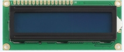 |
| 11   | Soil Sensor                          | 1        | 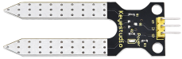 |
| 12   | Analog Gas Sensor                    | 1        | 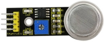 |
| 13   | Breadboard                           | 1        | 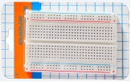 |
| 14   | Platform                             | 1        | 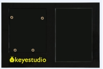 |
| 15   | 8*8 Dot Matrix                       | 1        | 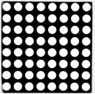 |
| 16   | 1-digit Segment Displays             | 1        |  |
| 17   | 4-digit Segment Displays             | 1        | 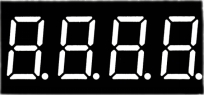 |
| 18   | Button                               | 4        | 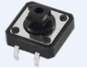 |
| 19   | Blue LED                             | 5        | 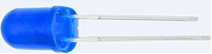 |
| 20   | Red LED                              | 5        |  |
| 21   | Yellow LED                           | 5        | 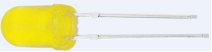 |
| 22   | Passive Buzzer                       | 1        | 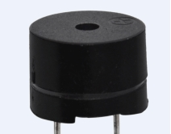 |
| 23   | Active Buzzer                        | 1        | 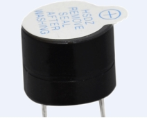 |
| 24   | 1K                                   | 5        | 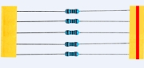 |
| 25   | 10K                                  | 5        | 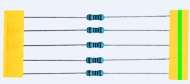 |
| 26   | 220R                                 | 8        | 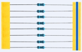 |
| 27   | Full-color RGB                       | 1        | 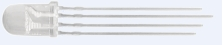 |
| 28   | Screw                                | 4        | 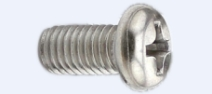 |
| 29   | Adjustable Resistor                  | 1        |  |
| 30   | IC 595                               | 1        | 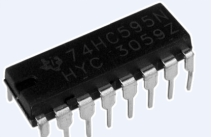 |
| 31   | Button Cap                           | 4        | 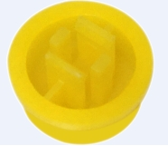 |
| 32   | Jumper Wire                          | 1        | 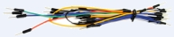 |
| 33   | USB Cable                            | 1        | 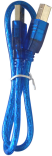 |
| 34   | Female to Female Dupont Line         | 60       | 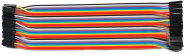 |
| 35   | Dust Sensor                          | 1        | 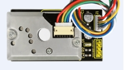 |
| 36   | Resistor Chip                        | 1        | 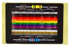 |