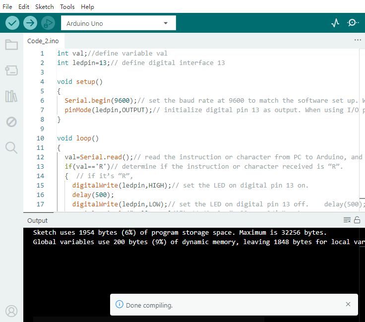

### Project 1 Hello World

**1.Introduction**

As for starters, we will begin with something simple. In this project, you only need an Arduino and a USB cable to start the "Hello World!" experiment. This is a communication test of your Arduino and PC, also a primer project for you to have your first try of the Arduino world!

**2.Hardware Required**

- Arduino board x1
- USB cable x1

**3.Sample Code**
After installing driver for Arduino, let's open Arduino software and compile code that enables Arduino to print "Hello World!" under your instruction. Of course, you can compile code for Arduino to continuously echo "Hello World!" without instruction. A simple If () statement will do the instruction trick. With the onboard LED connected to pin 13, we can instruct the LED to blink first when Arduino gets an instruction and then print "Hello World!”.

```c
int val;//define variable val
int ledpin=13;// define digital interface 13

void setup()
{
  Serial.begin(9600);// set the baud rate at 9600 to match the software set up. When connected to a specific device, (e.g. bluetooth), the baud rate needs to be the same with it.
  pinMode(ledpin,OUTPUT);// initialize digital pin 13 as output. When using I/O ports on an Arduino, this kind of set up is always needed.
}

void loop()
{
  val=Serial.read();// read the instruction or character from PC to Arduino, and assign them to Val.
  if(val=='R')// determine if the instruction or character received is “R”.
  {  // if it’s “R”,    
    digitalWrite(ledpin,HIGH);// set the LED on digital pin 13 on. 
    delay(500);
    digitalWrite(ledpin,LOW);// set the LED on digital pin 13 off.    delay(500);
    Serial.println("Hello World!");// display“Hello World！”string.
  }
}
```

**4.Result**



Click to open serial monitor, Input R, LED 13 will blink once, PC will receive information from Arduino: Hello World.

