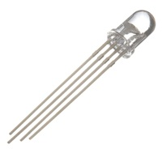
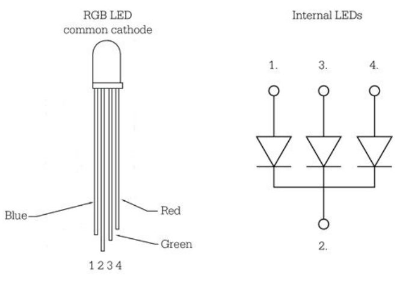
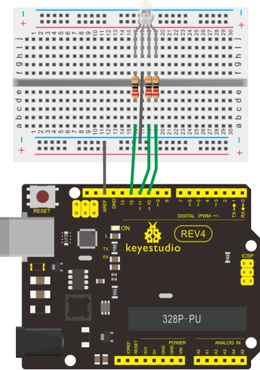

### Project 10 RGB LED



**1.Introduction**

- Tricolor principle to display various colors
- PWM controlling ports to display full color
- Can be driven directly by Arduino PWM interfaces 



**2.Hardware Required**

- Arduino Board *1
- USB Cable *1
- RGB LED * 1
- 220Ω Resistor*3
- Breadboard*1
- Breadboard Jumper Wires

**3.Circuit Connection**



**4.Sample Code**

```c
int redpin = 11; //select the pin for the red LED
int bluepin =10; // select the pin for the blue LED
int greenpin =9;// select the pin for the green LED
int val;

void setup() 
{
  pinMode(redpin, OUTPUT);
  pinMode(bluepin, OUTPUT);
  pinMode(greenpin, OUTPUT);
  Serial.begin(9600);
}

void loop() 
{
    for(val=255; val>0; val--)
    {
       analogWrite(11, val);
       analogWrite(10, 255-val);
       analogWrite(9, 128-val);
       delay(1); 
    }
    for(val=0; val<255; val++)
    {
       analogWrite(11, val);
       analogWrite(10, 255-val);
       analogWrite(9, 128-val);
       delay(1); 
    }
    Serial.println(val, DEC);
}
```

**5.Result**

Directly copy the above code into arduino IDE, and click upload ，wait a few seconds, you can see a full-color LED.