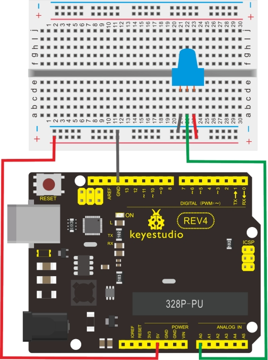
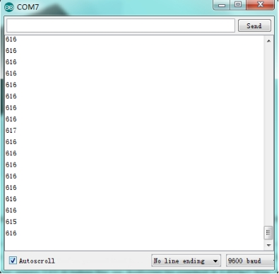

### Project 11 Analog Value Reading

**1.Introduction** 

In this experiment, we will begin the learning of analog I/O interfaces. On an Arduino, there are 6 analog interfaces numbered from 0 to 5. These 6 interfaces can also be used as digital ones numbered as 14-19. After a brief introduction, let's begin our project. Potentiometer used here is a typical output component of analog value that is familiar to us. 

**2.Hardware Required**

- Arduino Board *1
- USB Cable *1
- Potentiometer *1 
- Breadboard*1
- Breadboard Jumper Wires 

**3.Connection**

In this experiment, we will convert the resistance value of the potentiometer to analog ones and display it on the screen. This is an application we need to master well for our future experiments.
Connection circuit as below:

**4.Connection for UNO R3**



Note：The analog interface we use here is interface 0.

**5.Sample Code**

The program compiling is simple. An analogRead () Statement can read the value of the interface. The A/D acquisition of Arduino 328 is in 10 bits, so the value it reads is among 0 to 1023. One difficulty in this project is to display the value on the screen, which is actually easy to learn. First, we need to set the baud rate in voidsetup (). Displaying the value is a communication between Arduino and PC, so the baud rate of the Arduino should match the the one in the PC's software set up. Otherwise, the display will be messy codes or no display at all. In the lower right corner of the Arduino software monitor window, there is a button for baud rate set up. The set up here needs to match the one in the program. The statement in the program is Serial.begin(); enclosed is the baud rate value, followed by statement for displaying. You can either use Serial.print() or Serial.println() statement. 

```c
int potpin=0;// initialize analog pin 0
int ledpin=13;// initialize digital pin 13
int val=0;// define val, assign initial value 0

void setup()
{
    pinMode(ledpin,OUTPUT);// set digital pin as “output”
    Serial.begin(9600);// set baud rate at 9600
}

void loop()
{
    digitalWrite(ledpin,HIGH);// turn on the LED on pin 13
    delay(50);// wait for 0.05 second
    digitalWrite(ledpin,LOW);// turn off the LED on pin 13
    delay(50);// wait for 0.05 second
    val=analogRead(potpin);// read the analog value of analog pin 0, and assign it to val 
    Serial.println(val);// display val’s value
}
```

**6.Result**

The sample program uses the built-in LED connected to pin 13. Each time the device reads a value, the LED blinks.

Below is the analog value it reads.



When you rotate the potentiometer knob, you can see the displayed value changes. The reading of analog value is a very common function since most sensors output analog value. After calculation, we can have the corresponding value we need.

The experiment is now completed, thank you.