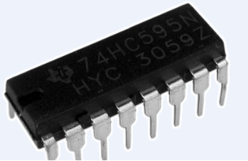

### Project 12 74HC595



**1.Introduction**

To put it simply, 74HC595 is a combination of 8-digit shifting register, memorizer and equipped with tri-state output. Here, we use it to control 8 LEDs. You may wonder why use a 74HC595 to control LED? Well, think about how many I/O it takes for an Arduino to control 8 LEDs? Yes, 8. For an Arduino 168, it has only 20 I/O including analog ports. So, to save port resources, we use 74HC595 to reduce the number of ports it needs. Using 74HC595 enables us to use 3 digital I/O port to control 8 LEDs!

**2.Hardware Required**

- Arduino Board *1
- USB Cable *1
- 74HC595 Chip*1 
- Red M5 LED*4 
- blue M5 LED*4
- 220Ω Resistor*8
- Breadboard*1 
- Breadboard Jumper Wires

Note: for pin 13 OE port of 74HC595, it needs to connect to GND

**3.Circuit Connection**


The circuit may seem complicated, but once you give it a good look, you will find it easy!

**4.Sample Code**

```c
int data = 2;// set pin 14 of 74HC595as data input pin SI 
int clock = 5;// set pin 11 of 74hc595 as clock pin SCK
int latch = 4;// set pin 12 of 74hc595 as output latch RCK 
int ledState = 0;
const int ON = HIGH;
const int OFF = LOW;

void setup()
{
    pinMode(data, OUTPUT);
    pinMode(clock, OUTPUT);
    pinMode(latch, OUTPUT);
}

void loop()
{
    for(int i = 0; i < 256; i++)
    {
        updateLEDs(i);
        delay(500);
    }
}

void updateLEDs(int value)
{
    digitalWrite(latch, LOW);//
    shiftOut(data, clock, MSBFIRST, ~value);// serial data “output”, high level first
    digitalWrite(latch, HIGH);// latch
}
```

**5.Result**

After downloading the program, you can see 8 LEDs displaying 8-bit binary number.