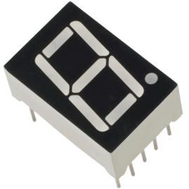
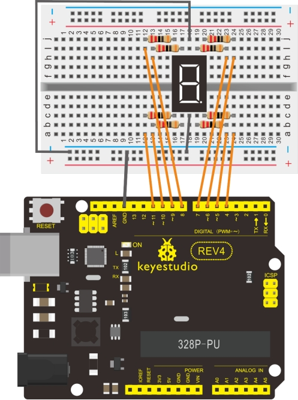

### Project 13 1-digit LED Segment Display



**1.Introduction** 

LED segment displays are common for displaying numerical information. It's widely applied on displays of electromagnetic oven, full automatic washing machine, water temperature display, electronic clock etc. It is necessary that we learn how it works.

LED segment display is a semiconductor light-emitting device. Its basic unit is a light-emitting diode (LED). LED segment display can be divided into 7-segment display and 8-segment display according to the number of segments. 8-segment display has one more LED unit ( for decimal point display) than 7-segment one. In this experiment, we use a 8-segment display. According to the wiring method of LED units, LED segment displays can be divided into display with common anode and display with common cathode. Common anode display refers to the one that combine all the anodes of LED units into one common anode (COM).

For the common anode display, connect the common anode (COM) to +5V. When the cathode level of a certain segment is low, the segment is on; when the cathode level of a certain segment is high, the segment is off. For the common cathode display, connect the common cathode (COM) to GND. When the anode level of a certain segment is high, the segment is on; when the anode level of a certain segment is low, the segment is off.


Each segment of the display consists of an LED.  So when you use it, you also need use a current-limiting resistor. Otherwise, LED will be burnt out. In this experiment, we use a common cathode display. As we mentioned above, for common cathode display, connect the common cathode (COM) to GND. When the anode level of a certain segment is high, the segment is on; when the anode level of a certain segment is low, the segment is off.

**2.Hardware Required**

- Arduino Board *1
- USB Cable *1

- 8-DIGIT segment display*1
- 220Ω resistor*8
- Breadboard*1
- Breadboard jumper wires

**3.Circuit Connection:**



**5.Sample Code:**

There are seven segments for numerical display, one for decimal point display. Corresponding segments will be turned on when displaying certain numbers. For example, when displaying number 1, b and c segments will be turned on. We compile a subprogram for each number, and compile the main program to display one number every 2 seconds, cycling display number 0 ~ 9. The displaying time for each number is subject to the delay time, the longer the delay time, the longer the displaying time. 

```c
// set the IO pin for each segment
int a=7;// set digital pin 7 for segment a
int b=6;// set digital pin 6 for segment b
int c=5;// set digital pin 5 for segment c
int d=10;// set digital pin 10 for segment d
int e=11;// set digital pin 11 for segment e
int f=8;// set digital pin 8 for segment f
int g=9;// set digital pin 9 for segment g
int dp=4;// set digital pin 4 for segment dp

void digital_0(void) // display number 5
{
    unsigned char j;
    digitalWrite(a,HIGH);
    digitalWrite(b,HIGH);
    digitalWrite(c,HIGH);
    digitalWrite(d,HIGH);
    digitalWrite(e,HIGH);
    digitalWrite(f,HIGH);
    digitalWrite(g,LOW);
    digitalWrite(dp,LOW);
}

void digital_1(void) // display number 1
{
    unsigned char j;
    digitalWrite(c,HIGH);// set level as “high” for pin 5, turn on segment c
    digitalWrite(b,HIGH);// turn on segment b
    for(j=7;j<=11;j++)// turn off other segments
    digitalWrite(j,LOW);
    digitalWrite(dp,LOW);// turn off segment dp
}

void digital_2(void) // display number 2
{
    unsigned char j;
    digitalWrite(b,HIGH);
    digitalWrite(a,HIGH);
    for(j=9;j<=11;j++)
    digitalWrite(j,HIGH);
    digitalWrite(dp,LOW);
    digitalWrite(c,LOW);
    digitalWrite(f,LOW);
}

void digital_3(void) // display number 3
{
    digitalWrite(g,HIGH);
    digitalWrite(a,HIGH);
    digitalWrite(b,HIGH);
    digitalWrite(c,HIGH);
    digitalWrite(d,HIGH);
    digitalWrite(dp,LOW);
    digitalWrite(f,LOW);
    digitalWrite(e,LOW);
}

void digital_4(void) // display number 4
{
    digitalWrite(c,HIGH);
    digitalWrite(b,HIGH);
    digitalWrite(f,HIGH);
    digitalWrite(g,HIGH);
    digitalWrite(dp,LOW);
    digitalWrite(a,LOW);
    digitalWrite(e,LOW);
    digitalWrite(d,LOW);
}

void digital_5(void) // display number 5
{
    unsigned char j;
    digitalWrite(a,HIGH);
    digitalWrite(b, LOW);
    digitalWrite(c,HIGH);
    digitalWrite(d,HIGH);
    digitalWrite(e, LOW);
    digitalWrite(f,HIGH);
    digitalWrite(g,HIGH);
    digitalWrite(dp,LOW);
}

void digital_6(void) // display number 6
{
    unsigned char j;
    for(j=7;j<=11;j++)
    digitalWrite(j,HIGH);
    digitalWrite(c,HIGH);
    digitalWrite(dp,LOW);
    digitalWrite(b,LOW);
}

void digital_7(void) // display number 7
{
    unsigned char j;
    for(j=5;j<=7;j++)
    digitalWrite(j,HIGH);
    digitalWrite(dp,LOW);
    for(j=8;j<=11;j++)
    digitalWrite(j,LOW);
}

void digital_8(void) // display number 8
{
    unsigned char j;
    for(j=5;j<=11;j++)
    digitalWrite(j,HIGH);
    digitalWrite(dp,LOW);
}

void digital_9(void) // display number 5
{
    unsigned char j;
    digitalWrite(a,HIGH);
    digitalWrite(b,HIGH);
    digitalWrite(c,HIGH);
    digitalWrite(d,HIGH);
    digitalWrite(e, LOW);
    digitalWrite(f,HIGH);
    digitalWrite(g,HIGH);
    digitalWrite(dp,LOW);
}

void setup()
{
    int i;// set variable
    for(i=4;i<=11;i++)
    	pinMode(i,OUTPUT);// set pin 4-11as “output”
}

void loop()
{
    while(1)
    {
        digital_0();// display number 0
        delay(1000);// wait for 1s
        digital_1();// display number 1
        delay(1000);// wait for 1s
        digital_2();// display number 2
        delay(1000); // wait for 1s
        digital_3();// display number 3
        delay(1000); // wait for 1s
        digital_4();// display number 4
        delay(1000); // wait for 1s
        digital_5();// display number 5
        delay(1000); // wait for 1s
        digital_6();// display number 6
        delay(1000); // wait for 1s
        digital_7();// display number 7
        delay(1000); // wait for 1s
        digital_8();// display number 8
        delay(1000); // wait for 1s
        digital_9();// display number 9
        delay(1000); // wait for 1s
    }
}
```

**6.Result**

LED segment display displays number 0 to 9.