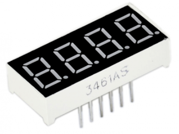
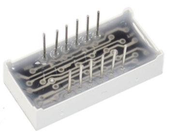
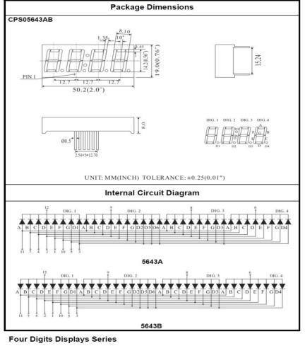
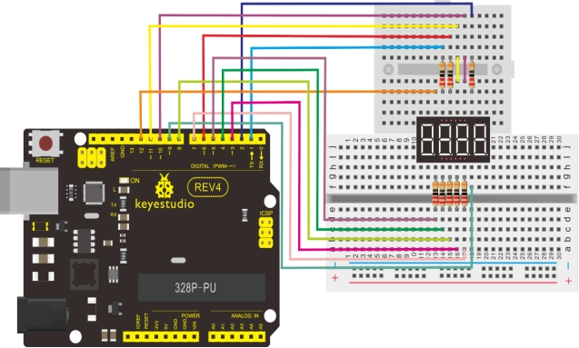

### Project 14 4-digit LED Segment Display



**1.Introduction** 

In this experiment, we use an Arduino to drive a common anode, 4-digit, 7-segment LED display. For LED display, current-limiting resistors are indispensable. There are two wiring method for Current-limiting resistor. One is to connect one resistor for each anode, 4 in totals for d1-d4 anode. An advantage for this method is that it requires fewer resistors, only 4. But it cannot maintain consistent brightness, 1 the brightest, 8, the least bright. Another method is to connect one resistor to each pin. It guarantees consistent brightness, but requires more resistors. In this experiment, we use 8 220Ω resistors (we use 220Ω resistors because no 100Ω resistor available. If you use 100Ω, the displaying will be brighter).

**2.Hardware Required**

- Arduino Board *1
- USB Cable *1
- 4-digit Segment Displays*1 
- 220Ω Resistor*8
- Breadboard*1 
- Breadboard Jumper Wires

**3.Circuit Connection**

For 4-digit displays, there are 12 pins in total. When you place the decimal point downward , the pin on the lower left part is refer to as 1, the upper left part 12. 



Manual for LED segment display：





**4.Sample Code**

```c
// display 1234 
// select pin for cathode
int a = 1;
int b = 2;
int c = 3;
int d = 4;
int e = 5;
int f = 6;
int g = 7;
int dp = 8;
// select pin for anode
int d4 = 9;
int d3 = 10;
int d2 = 11;
int d1 = 12;
// set variable
long n = 1230;
int x = 100;
int del = 55;  // fine adjustment for clock
	 
void setup()
{
    pinMode(d1, OUTPUT);
    pinMode(d2, OUTPUT);
    pinMode(d3, OUTPUT);
	pinMode(d4, OUTPUT);
	pinMode(a, OUTPUT);
	pinMode(b, OUTPUT);
	pinMode(c, OUTPUT);
	pinMode(d, OUTPUT);
	pinMode(e, OUTPUT);
	pinMode(f, OUTPUT);
	pinMode(g, OUTPUT);
	pinMode(dp, OUTPUT);
}
/////////////////////////////////////////////////////////////
void loop()
{
 	Display(1, 1);
 	Display(2, 2);
 	Display(3, 3);
 	Display(4, 4);
}
///////////////////////////////////////////////////////////////
void WeiXuan(unsigned char n)//
{
    switch(n)
    {
	  case 1: 
	   digitalWrite(d1,LOW);
 	   digitalWrite(d2, HIGH);
	   digitalWrite(d3, HIGH);
	   digitalWrite(d4, HIGH);   
	   break;
	 case 2: 
	   digitalWrite(d1, HIGH);
 	   digitalWrite(d2, LOW);
	   digitalWrite(d3, HIGH);
	   digitalWrite(d4, HIGH); 
	   break;
	 case 3: 
	   digitalWrite(d1,HIGH);
 	   digitalWrite(d2, HIGH);
	   digitalWrite(d3, LOW);
	   digitalWrite(d4, HIGH); 
	   break;
	 case 4: 
	   digitalWrite(d1, HIGH);
 	   digitalWrite(d2, HIGH);
	   digitalWrite(d3, HIGH);
	   digitalWrite(d4, LOW); 
	   break;
        default :
           digitalWrite(d1, HIGH);
	   digitalWrite(d2, HIGH);
	   digitalWrite(d3, HIGH);
	   digitalWrite(d4, HIGH);
       break;
    }
}

void Num_0()
{
  digitalWrite(a, HIGH);
  digitalWrite(b, HIGH);
  digitalWrite(c, HIGH);
  digitalWrite(d, HIGH);
  digitalWrite(e, HIGH);
  digitalWrite(f, HIGH);
  digitalWrite(g, LOW);
  digitalWrite(dp,LOW);
}

void Num_1()
{
  digitalWrite(a, LOW);
  digitalWrite(b, HIGH);
  digitalWrite(c, HIGH);
  digitalWrite(d, LOW);
  digitalWrite(e, LOW);
  digitalWrite(f, LOW);
  digitalWrite(g, LOW);
  digitalWrite(dp,LOW);
}

void Num_2()
{
  digitalWrite(a, HIGH);
  digitalWrite(b, HIGH);
  digitalWrite(c, LOW);
  digitalWrite(d, HIGH);
  digitalWrite(e, HIGH);
  digitalWrite(f, LOW);
  digitalWrite(g, HIGH);
  digitalWrite(dp,LOW);
}

void Num_3()
{
  digitalWrite(a, HIGH);
  digitalWrite(b, HIGH);
  digitalWrite(c, HIGH);
  digitalWrite(d, HIGH);
  digitalWrite(e, LOW);
  digitalWrite(f, LOW);
  digitalWrite(g, HIGH);
  digitalWrite(dp,LOW);
}

void Num_4()
{
  digitalWrite(a, LOW);
  digitalWrite(b, HIGH);
  digitalWrite(c, HIGH);
  digitalWrite(d, LOW);
  digitalWrite(e, LOW);
  digitalWrite(f, HIGH);
  digitalWrite(g, HIGH);
  digitalWrite(dp,LOW);
}

void Num_5()
{
  digitalWrite(a, HIGH);
  digitalWrite(b, LOW);
  digitalWrite(c, HIGH);
  digitalWrite(d, HIGH);
  digitalWrite(e, LOW);
  digitalWrite(f, HIGH);
  digitalWrite(g, HIGH);
  digitalWrite(dp,LOW);
}

void Num_6()
{
  digitalWrite(a, HIGH);
  digitalWrite(b, LOW);
  digitalWrite(c, HIGH);
  digitalWrite(d, HIGH);
  digitalWrite(e, HIGH);
  digitalWrite(f, HIGH);
  digitalWrite(g, HIGH);
  digitalWrite(dp,LOW);
}

void Num_7()
{
  digitalWrite(a, HIGH);
  digitalWrite(b, HIGH);
  digitalWrite(c, HIGH);
  digitalWrite(d, LOW);
  digitalWrite(e, LOW);
  digitalWrite(f, LOW);
  digitalWrite(g, LOW);
  digitalWrite(dp,LOW);
}
void Num_8()
{
  digitalWrite(a, HIGH);
  digitalWrite(b, HIGH);
  digitalWrite(c, HIGH);
  digitalWrite(d, HIGH);
  digitalWrite(e, HIGH);
  digitalWrite(f, HIGH);
  digitalWrite(g, HIGH);
  digitalWrite(dp,LOW);
}

void Num_9()
{
  digitalWrite(a, HIGH);
  digitalWrite(b, HIGH);
  digitalWrite(c, HIGH);
  digitalWrite(d, HIGH);
  digitalWrite(e, LOW);
  digitalWrite(f, HIGH);
  digitalWrite(g, HIGH);
  digitalWrite(dp,LOW);
}

void Clear()  // clear the screen
{
  digitalWrite(a, LOW);
  digitalWrite(b, LOW);
  digitalWrite(c, LOW);
  digitalWrite(d, LOW);
  digitalWrite(e, LOW);
  digitalWrite(f, LOW);
  digitalWrite(g, LOW);
  digitalWrite(dp,LOW);
}

void pickNumber(unsigned char n)// select number
{
  switch(n)
  {
   case 0:Num_0();
   break;
   case 1:Num_1();
   break;
   case 2:Num_2();
   break;
   case 3:Num_3();
   break;
   case 4:Num_4();
   break;
   case 5:Num_5();
   break;
   case 6:Num_6();
   break;
   case 7:Num_7();
   break;
   case 8:Num_8();
   break;
   case 9:Num_9();
   break;
   default:Clear();
   break; 
  }
}

void Display(unsigned char x, unsigned char Number)//  take x as coordinate and display number
{
  WeiXuan(x);
  pickNumber(Number);
  delay(1);
  Clear() ; // clear the screen
}
```

**5.Result**

Download the above code to the controller board and see the result.The experiment result displays 1234 on the display. 

Note: if it’s not displaying correctly, check the wiring.Thank you.