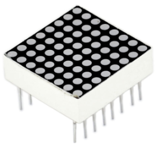
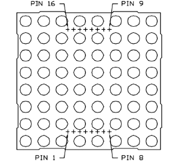
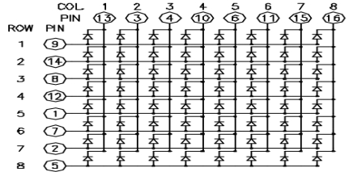

### Project 15 8 *8 LED Matrix



**1.Introduction** 

With low-voltage scanning, LED dot-matrix displays have advantages such as power saving, long service life, low cost, high brightness, wide angle of view, long visual range, waterproof, and numerous specifications. LED dot-matrix displays can meet the needs of different applications and thus have a broad development prospect. This time, we will conduct an LED dot-matrix experiment to experience its charm firsthand.

**2.Hardware required**

- Arduino Board *1
- USB Cable *1
- 8 * 8 Dot Matrix*1 
- 220ΩResistor*8
- Breadboard*1 
- Breadboard Jumper Wires

**3.Circuit Connection **
The external view of a dot-matrix is shown as follows:



The display principle of the 8 * 8 dot-matrix: The 8*8 dot-matrix is made up of sixty-four LEDs, and each LED is placed at the cross point of a row and a column. When the electrical level of a certain row is 1 and the electrical level of a certain column is 0, the corresponding LED will light up. If you want to light the LED on the first dot, you should set pin 9 to high level and pin 13 to low level. If you want to light LEDs on the first row, you should set pin 9 to high level and pins 13, 3, 4, 10, 6, 11, 15 and 16 to low level. If you want to light the LEDs on the first column, set pin 13 to low level and pins 9, 14, 8, 12, 1, 7, 2 and 5 to high level.

The internal view of a dot-matrix is shown as follows:



The principle of 74HC595 has been previously illustrated. One chip is used to control the rows of the dot-matrix while the other chip is used to control the columns.

**4.Connection for UNO R3**


**5.Sample Code for Displaying “0”**

```c
// set an array to store character of “0”
unsigned char Text[]={0x00,0x1c,0x22,0x22,0x22,0x22,0x22,0x1c};
void Draw_point(unsigned char x,unsigned char y)// point drawing function
{ 
   clear_();
   digitalWrite(x+2, HIGH);
   digitalWrite(y+10, LOW);
   delay(1);
}

void show_num(void)// display function, call point drawing function
{
  unsigned char i,j,data;
  for(i=0;i<8;i++)
  {
    data=Text[i];
    for(j=0;j<8;j++)
    {
      if(data & 0x01)Draw_point(j,i);
      data>>=1;
    }  
  }
}

void setup()
{ 
    int i = 0 ; 
    for(i=2;i<18;i++) 
    { 
       pinMode(i, OUTPUT); 
    }  
    clear_(); 
}

void loop()
{ 
	show_num();    
}

void clear_(void)// clear screen
{
	for(int i=2;i<10;i++)
  	digitalWrite(i, LOW);
  	for(int i=0;i<8;i++)
  	digitalWrite(i+10, HIGH);
}
```

**6.Result**
Burn the program into Uno board The dot-matrix will display 0.