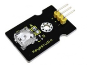
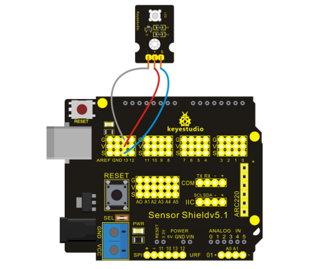

### Project 16 LED Blinking



**1.Introduction**

This project is easier and you can make LED blink simply by modifying the codes a bit.

**2.Hardware Required**

- Arduino Board *1
- V5 Shield*1
- USB Cable*1
- Piranha LED Module*1
- Dupont Line*3  

**3.Circuit Connection**



**4.Sample Code**

```c
 int led = 13;

// the setup routine runs once when you press reset:

void setup() 
{                
  // initialize the digital pin as an output.
  pinMode(led, OUTPUT);     
}

// the loop routine runs over and over again forever:
void loop() 
{
  digitalWrite(led, HIGH);   // turn the LED on (HIGH is the voltage level)
  delay(1000);               // wait for a second
  digitalWrite(led, LOW);    // turn the LED off by making the voltage LOW
  delay(1000);               // wait for a second
}
```

**5.Result**

Upload the codes to REV4 board and then you can see piranha LED and L light on the board are blinking together with an interval of one second.