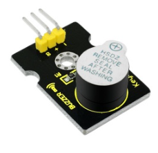
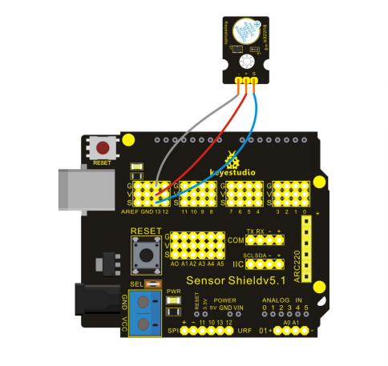

### Project 17 Active Buzzer Module



**1.Introduction**

This project uses the same codes as Project 1’s, and then the buzzer will ring for one second and stop for one second.

**2.Hardware Required**

- Arduino Board *1
- V5 Shield*1

- USB Cable*1
- Active Buzzer Module*1
- Dupont Line*3

**3.Circuit Connection**



**4.Sample Code**

```c
int led = 13;

// the setup routine runs once when you press reset:
void setup() 
{                
  // initialize the digital pin as an output.
  pinMode(led, OUTPUT);     
}

// the loop routine runs over and over again forever:
void loop() 
{
  digitalWrite(led, HIGH);   // turn the LED on (HIGH is the voltage level)
  delay(1000);               // wait for a second
  digitalWrite(led, LOW);    // turn the LED off by making the voltage LOW
  delay(1000);               // wait for a second
}
```

**5.Result**

After uploading the codes to REV4 board, you can hear the buzzer ringing and see the L light blinking at the same time with an interval of one second.