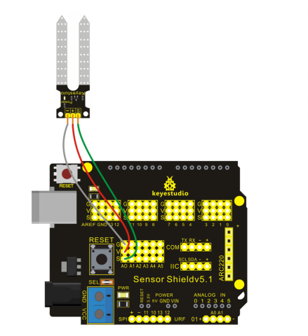

### Project 3 Soil Module


**1.Introduction**

Soil Sensor is an easy moisture sensor detecting the moisture of soil. If soil is lack of water, the output analog value decreases; if not, the value increases. This sensor detects the moisture by reading out the current change between two electrodes.

It uses two probes to make current flow through soil (as a resistor), and then read out the value to know quantity of moisture. When water is enough, soil can conduct electricity more easily(decreasing resistance); when lack of water, the electrical conductivity of soil is bad (increasing resistance).

**2.Hardware Required**

- Arduino Board *1
- V5 Shield*1
- USB Cable*1
- Soil Sensor Module*1
- Soil for Testing*1
- Dupont Line*3

**3.Circuit Connection**



**4.Sample Code**

```c
void setup() 
{
  Serial.begin(9600);
}

void loop() 
{
  int sensorValue = analogRead(A0);
  Serial.println(sensorValue, DEC);
}
```

**5.Result**
After uploading the codes to REV4 board, insert the sensor into soil of different humidity, and you can see different analog value through serial port. When the humidity increases, analog value also increases; otherwise, the value decreases.