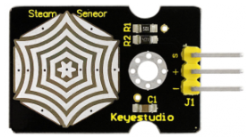
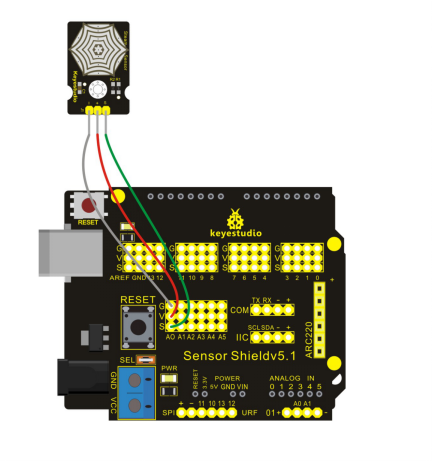

### Project 19 Steam Sensor



**1.Introduction** 

When there is drop or vapor adhered to sensing point of vapor sensor, MCU will get a feedback of analog signal from S signal pin of the sensor. You can read out the value from MCU to deduce whether it rains.

**2.Hardware Required**

- Arduino board * 1
- V5 Shield *1
- USB Cable*1
- Steam Sensor*1
- Dupont Line*3

**3.Circuit Connection**



**4.Sample Code**

```c
void setup() 
{
  // initialize serial communication at 9600 bits per second:
  Serial.begin(9600);
}

// the loop routine runs over and over again forever:
void loop() 
{
  // read the input on analog pin 0:
  int sensorValue = analogRead(A0);
  // print out the value you read:
  Serial.println(sensorValue);
  delay(1);        // delay in between reads for stability
}
```

**5.Result**

After uploading the codes to REV4 board, open serial monitor, and you can see current value. Add drop on the sensing point and the analog value increases.