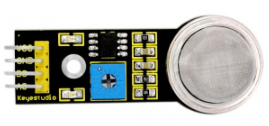
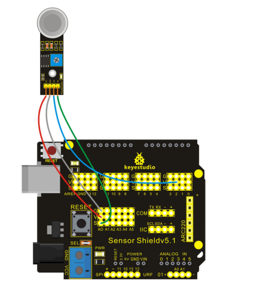

### Project 20 MQ 135 Gas Sensor



**1.Introduction** 

MQ135 adopts SnO2 as its gas sensitive material because SnO2 has low electrical conductivity in the clean air. So when it surrounded by polluted air, the electrical conductivity of MQ135 will increase with the increase of pollutants, and the change in electrical conductivity can be converted to corresponding output signal.

MQ135 has a high sensitivity to ammonia, sulfide, benzene vapor, smoke and other harmful gas. It can detect various harmful gases, making it a cost-effective choice suitable for multiple applications.

**2.Hardware Required**

- Arduino Board  *1
- V5 Shield *1
- USB Cable*1
- MQ135 Gas Sensor*1
- Dupont Line*4

**3.Circuit Connection**




**4.Sample Code**

```c
const int buttonPin = 2;     // the number of the pushbutton pin
const int ledPin =  13;      // the number of the LED pin

// variables will change:
int buttonState = 0;         // variable for reading the pushbutton status

void setup() 
{
  // initialize the LED pin as an output:
  pinMode(ledPin, OUTPUT);      
  // initialize the pushbutton pin as an input:
  pinMode(buttonPin, INPUT);   
  Serial.begin(9600);  
}

void loop()
{
  int val;
  val=analogRead(0);//Read Gas value from analog 0
  Serial.println(val,DEC);//Print the value to serial port
  // read the state of the pushbutton value:
  buttonState = digitalRead(buttonPin);
  // check if the pushbutton is pressed.
  // if it is, the buttonState is HIGH:
  if (buttonState == HIGH) 
  {     
    // turn LED on:    
    digitalWrite(ledPin, LOW);  
  } 
  else 
  {
    // turn LED off:
    digitalWrite(ledPin, HIGH); 
  }
  delay(100);
}
```

**5.Result**
After uploading the codes to REV4 board, adjust the sensitivity of the sensor through potentiometer. Light up a lighter close to the sensor, and you can see the analog value increases, LED on the sensor is on but L light on REV4 board is off.