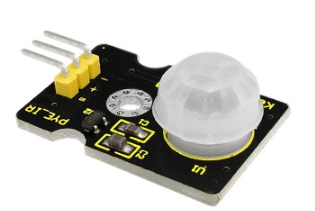
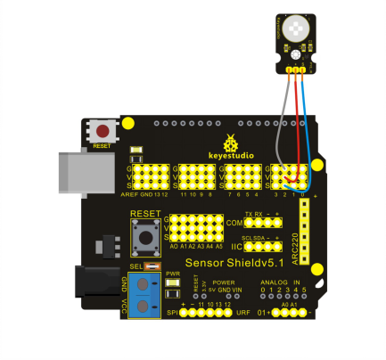

### Project 21 PIR Motion Sensor



**1.Introduction** 

PIR Motion Sensor is an instrument converting IR into electrical signal with non-touch sensing. It is composed of detecting unit, Fresnel lens, interference filter , adaptor of field effect transistor and est.

It senses IR with pyroelectric effect which means when electron of heated object moves from high temperature to low temperature, the object will produce current or its electric charge will pile up. First the lens receives IR from testing object; next the sensor converts IR into electrical signal ; finally, the circuit will process the signal.

**2.Hardware Required**

- Arduino Board  * 1
- V5 Shield *1
- USB Cable*1
- PIR Motion Sensor*1
- Dupont Line*3

**3.Circuit Connection4**



**4.Sample Code**

```c
int IRswitch = 2; //signal output of sensor；
int led = 13; //input of signal indicator;
boolean val = false; //reading out signal in real time;

void setup()
{
    pinMode(IRswitch,INPUT);
    pinMode(led,OUTPUT); //defining ports；
}

void loop()
{
    val = digitalRead(IRswitch); //reading output level；
    if(val)
    	digitalWrite(led,HIGH); //the LED lights up, when there is someone moving in detecting range；
    else
    	digitalWrite(led,LOW); //all going well, LED off；
    delay(10); //delaying for a moment, making LED stable；
}
```

**5.Result**

After uploading the codes to REV4 board, if there is someone moving around the sensor, the L light on REV4 board is on; if none, L light is on for some time and then off.