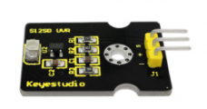
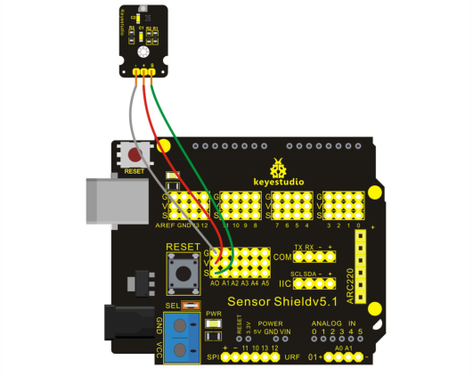
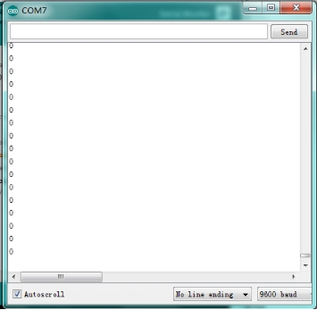
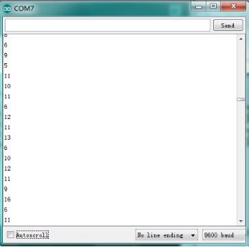

### Project 22 GUVA-S12SD 3528 Ultraviolet Sensor



**1.Introduction**

PIR Motion Sensor is an instrument converting IR into electrical signal with non-touch sensing. It is composed of detecting unit, Fresnel lens, interference filter , adaptor of field effect transistor and est.

It senses IR with pyroelectric effect which means when electron of heated object moves from high temperature to low temperature, the object will produce current or its electric charge will pile up. First the lens receives IR from testing object; next the sensor converts IR into electrical signal ; finally, the circuit will process the signal.

**2.Hardware Required**

- Arduino Board *1
- V5 Shield*1
- USB Cable*1
- Ultraviolet Sensor*1
- Dupont Line*3

**3.Circuit Connection**



**4.Sample Code**

```c
void setup() 
{
  // initialize serial communication at 9600 bits per second:
  Serial.begin(9600);
}

// the loop routine runs over and over again forever:
void loop() 
{
  // read the input on analog pin 0:
  int sensorValue = analogRead(A0);
  // print out the value you read:
  Serial.println(sensorValue);
  delay(1);        // delay in between reads for stability
}
```

**5.Result**

After uploading the codes, open serial monitor, and you can see current value is 0 when no sunlight. When putting the sensor under sunlight, you can see the intensity of sunlight displaying on the monitor.



