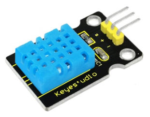
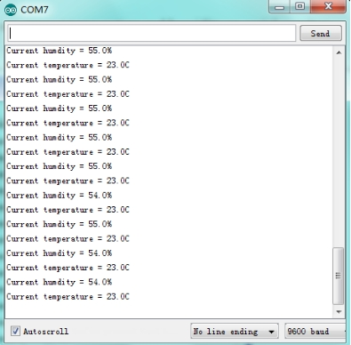

### Project 24 DHT11 Temperature and Humidity Sensor



**1.Introduction**

This DHT11 Temperature and Humidity Sensor features calibrated digital signal output with the temperature and humidity sensor complex. Its technology ensures high reliability and excellent long-term stability. It has excellent quality, fast response, anti-interference ability and high cost performance advantages. The single-wire serial interface system is integrated to make it quick and easy.

**2.Hardware Required:**

- Arduino Board *1
- V5 Shield*1
- USB Cable*1
- DHT11 Temperature and Humidity Sensor*1
- Dupont Line*3

**Circuit Connection:**


**3.Sample Code**

```c
int DHpin = 8; 
byte dat[5]; 
byte read_data() 
{ 
   byte data; 
  for(int i=0; i<8; i++) 
  { 
    if(digitalRead(DHpin) == LOW) 
    { 
      while(digitalRead(DHpin) == LOW);  //waiting for 50us； 
      delayMicroseconds(30);  // estimating the duration of high level to decide 0 or 1；  
      if(digitalRead(DHpin) == HIGH) 
      data |= (1<<(7-i));  //high-order forward, low-order backward
       while(digitalRead(DHpin) == HIGH);  //‘1’，waiting for receiving next one； 
    }   
  } 
     return data; 
} 
void start_test() 
{ 
  digitalWrite(DHpin,LOW);  //lower bus to delivery START signal； 
  delay(30);  //delayed time should be more than 18ms，so that DHT11 can detect START signal； 
  digitalWrite(DHpin,HIGH); 
  delayMicroseconds(40);  //waiting for DHT11 to respond； 
  pinMode(DHpin,INPUT); 
  while(digitalRead(DHpin) == HIGH); 
    delayMicroseconds(80);  //DHT11 giving out respond，lowering bus at 80us； 
 if(digitalRead(DHpin) == LOW); 
   delayMicroseconds(80);  //DHT11 pulling up bus at80us and then sending out data； 
 for(int i=0;i<4;i++)   //receiving data of temperature and humidity without consideration of check bit； 
   dat[i] = read_data(); 
 pinMode(DHpin,OUTPUT);
 digitalWrite(DHpin,HIGH);  //after sending data once, releasing bus, waiting for next time//START signal； 
} 
void setup() 
{ 
   Serial.begin(9600); 
   pinMode(DHpin,OUTPUT); 
} 
void loop() 
{ 
   start_test(); 
   Serial.print("Current humdity = "); 
   Serial.print(dat[0], DEC);  //displaying integer bit of humidity； 
   Serial.print('.'); 
   Serial.print(dat[1],DEC);  //displaying decimals bit of humidity； 
   Serial.println('%'); 
   Serial.print("Current temperature = "); 
   Serial.print(dat[2], DEC);  //displaying integer bit of temperature； 
   Serial.print('.'); 
   Serial.print(dat[3],DEC);  //displaying decimals bit of temperature； 
   Serial.println('C'); 
  delay(700); 

}
```

**4.Result**

After uploading the codes, you can see current temperature and humidity on serial monitor.

