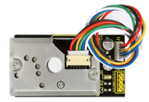
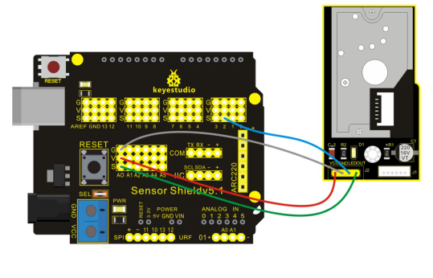
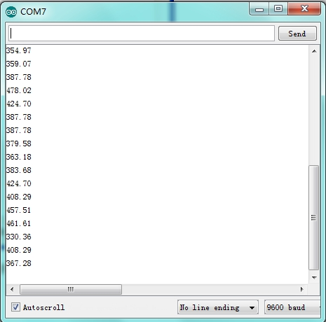

### Project 25 GP2Y10 Dust Sensor



**1.Introduction**

GP2Y10 Dust Sensor uses Sharp optics sensing system which detects reflected light of dust with IR optics sensor. It can sense very tiny granule, such as cigarette and features low-power consumption and high resolution ratio.

**2.Hardware Required**

- Arduino Board *1
- V5 Shield*1
- USB Cable*1
- GP2Y10 Dust Sensor*1
- Dupont Line*4

**3.Circuit Connection**



**4.Sample Code**

```c
int dustPin=A0;
float dustVal=0;
int ledPower=2;
int delayTime=280;
int delayTime2=40;
float offTime=9680;

void setup()
{
    Serial.begin(9600);
    pinMode(ledPower,OUTPUT);
    pinMode(dustPin, INPUT);
}
 
void loop()
{
    // ledPower is any digital pin on the arduino connected to Pin 3 on the sensor
    digitalWrite(ledPower,LOW); 
    delayMicroseconds(delayTime);
    dustVal=analogRead(dustPin); 
    delayMicroseconds(delayTime2);
    digitalWrite(ledPower,HIGH); 
    delayMicroseconds(offTime);
    delay(1000);
    if (dustVal>36.455)
    Serial.println((float(dustVal/1024)-0.0356)*120000*0.035);
}
```

**5.Result**

After uploading the codes, you can see the following value on serial monitor:



Data after testing in contrast to air quality：

- 3000 + = very bad
- 1050-3000 = bad
- 300-1050 = normal
- 150-300 = good
- 75-150 = very good
- 0-75 = tiptop