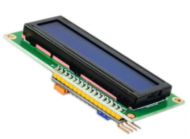
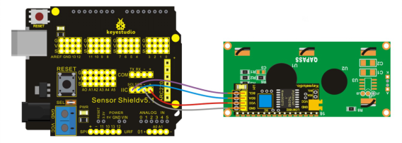

### Project 26 I2C1602 Liquid Crystal Display Module



**1.Introduction**

This module uses I2C communication mode to reduce the usage of I/O port of MCU. You can adjust contrast ratio of screen through potentiometer to get the optimal displaying effect.

**2.Hardware Required**

- Arduino Board *1
- V5 Shield*1
- USB Cable*1
- I2C1602 Liquid Crystal Display Module*1
- Dupont Line*4

**3.Circuit Connection**



**4.Sample Code**

```c
#include <LiquidCrystal_I2C.h> 
#include <Wire.h> 
LiquidCrystal_I2C lcd(0x27,16,2);  // set the LCD address to 0x27 for a 16 chars and 2 

void setup() 
{ 
  lcd.init();                      // initialize the lcd   
  // Print a message to the LCD. 
  lcd.backlight(); 
  lcd.print("Hello Arduino"); 
} 

void loop() 
{ 
}
```

**5.Result**

After uploading the codes, you can see there is displaying “Hello Arduino”on the screen.