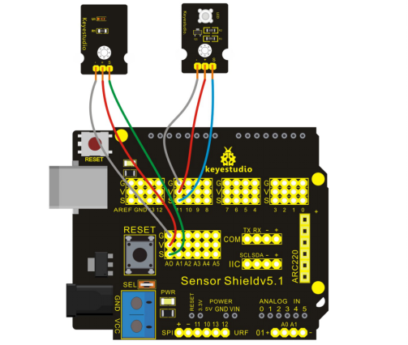

### Project 27 Ambient Light Sensor to Control Brightness of LED

**1.Introduction** 

In this project, we use TEMT6000 ambient light sensor to control brightness of LED.

**2.Hardware Required**

- Arduino Board *1
- V5 Shield*1
- USB Cable*1
- Shield V5*1
- Piranha LED Module*1
- Ambient Light Sensor*1
- Dupont Line*Several

**3.Circuit Connection**

Plug Shield V5 into REV4 board and don’t misplace pins to avoid damaging the board.



**4.Sample Code**

```c
void setup()
{
  pinMode(11,OUTPUT);          //choosing PWM digital output
}
 
void loop()
{
  int n = analogRead(A0);     //reading the value of A0 port（0-5V corresponding to 0-1204）
  analogWrite(11,n/4);         //maximum value of PWM is 255 so analog value n is divided by 4.  
}
```

**5.Result**

After uploading the codes, you can change the illumination intensity of the sensor to control the brightness of LED.