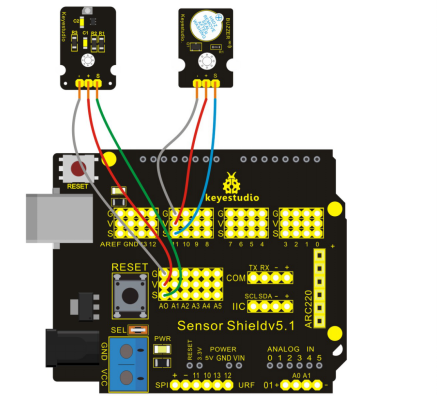

### Project 28 Ultraviolet Sensor to Alarm

**1.Introduction**

 When ultraviolet sensor receives ultraviolet ray up to a certain value, the buzzer rings.

**2.Hardware Required**

- Arduino Board *1
- V5 Shield*1
- USB Cable*1
- Shield V5*1
- Buzzer Module*1
- Ultraviolet Sensor*1
- Dupont Line*Several

**3.Circuit Connection**

Plug Shield V5 into UNO board and don’t misplace pins to avoid damaging the board.



**4.Sample Code**

```c
int ON = 11;
// the setup routine runs once when you press reset:
void setup() 
{
  // initialize serial communication at 9600 bits per second:
  pinMode(ON, OUTPUT);   
  Serial.begin(9600);
}

// the loop routine runs over and over again forever:
void loop() 
{
  // read the input on analog pin 0:
  int sensorValue = analogRead(A0);
  int n;
  // print out the value you read:
  if(sensorValue>=20)
  {
      for(n=0;n<8;n++)
      {
        digitalWrite(ON, HIGH);
        delay(1000); 
        digitalWrite(ON, LOW);
        delay(500);
      }
  }
  else
  {
     digitalWrite(ON, LOW); 
  } 
  Serial.println(sensorValue);
  delay(1);        // delay in between reads for stability
}
```

**5.Result**

After uploading the codes, you can see when the value is equal to or more than 20, the buzzer rings for 1 second and stop for 0.5 second, circulating 8 times.