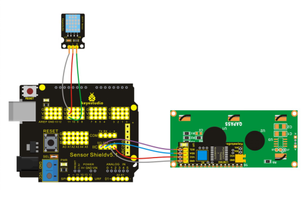

### Project 29 Displaying Temperature and Humidity on LCD

**1.Introduction** 

In this project, we use DHT11 temperature and humidity sensor to measure current temperature and humidity, displaying them on LCD1602.

**2.Hardware Required**

- Arduino Board *1
- V5 Shield*1
- USB Cable*1
- DHT11 Temperature and Humidity Sensor*1
- LCD1602*1
- Dupont Line*Several

**3.Circuit Connection**



**4.Sample Code**

```c
#include <Wire.h> 
#include <LiquidCrystal_I2C.h>
#include "DHT.h"
LiquidCrystal_I2C lcd(0x27,20,4);
#define DHTPIN 11     // what pin we're connected to

// Uncomment whatever type you're using!
#define DHTTYPE DHT11   // DHT 11 
//#define DHTTYPE DHT22   // DHT 22  (AM2302)
//#define DHTTYPE DHT21   // DHT 21 (AM2301)

DHT dht(DHTPIN, DHTTYPE);

void setup() {
  Serial.begin(9600); 
  Serial.println("DHTxx test!");
 
  dht.begin();
  
  lcd.init();
  lcd.init();
  lcd.backlight();
   lcd.clear();
   lcd.setCursor(0,0);
   lcd.print("DHT-11 test!");
}

void loop() 
{
  // Reading temperature or humidity takes about 250 milliseconds!
  // Sensor readings may also be up to 2 seconds 'old' (its a very slow sensor)
  float h = dht.readHumidity();
  float t = dht.readTemperature();
  
  lcd.clear();
  if (isnan(t) || isnan(h))
  {
    Serial.println("Failed to read from DHT");
    lcd.setCursor(0,0);
    lcd.print("Failed DHT");
  } 
  else 
  {
    Serial.print("Humidity: "); 
    lcd.setCursor(0,0);
    lcd.print("H:");
    Serial.print(h);
    lcd.setCursor(3,0);
    lcd.print(h);
    Serial.print(" %\t");
    lcd.setCursor(9,0);
    lcd.print("%");
    Serial.print("Temperature: "); 
    lcd.setCursor(0,1);
    lcd.print("T:");
    Serial.print(t);
    lcd.setCursor(3,1);
    lcd.print(t);
    Serial.println(" *C");
    lcd.setCursor(8,1);
    lcd.print(" *C");
  }
  delay(200);
}
```

**5.Result**

After adding the libraries and uploading the codes, you can see current temperature and humidity displayed on LCD1602.