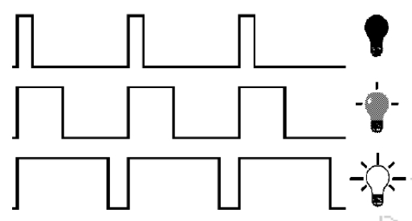
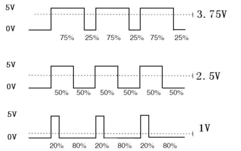
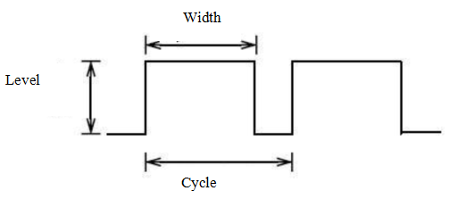
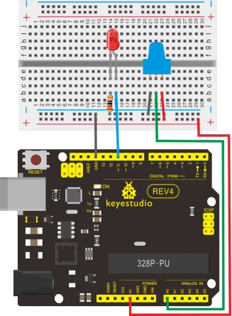

### Project 3 PWM Light Control



**1.Introduction**

PWM, short for Pulse Width Modulation, is a technique used to encode analog signal level into digital ones. A computer cannot output analog voltage but only digital voltage values such as 0V or 5V. So we use a high resolution counter to encode a specific analog signal level by modulating the duty cycle of PMW. The PWM signal is also digitalized because in any given moment, fully on DC power supply is either 5V (ON), or 0V (OFF). 

The voltage or current is fed to the analog load (the device that uses the power) by repeated pulse sequence being ON or OFF. Being on, the current is fed to the load; being off, it's not. With adequate bandwidth, any analog value can be encoded using PWM. The output voltage value is calculated via the on and off time. 

Output voltage = (turn on time/pulse time) * maximum voltage value.



PWM has many applications: lamp brightness regulating, motor speed regulating, sound making, etc. The following are the three basic parameters of PMW:



1. The amplitude of pulse width (minimum / maximum)
2. The pulse period (The reciprocal of pulse frequency in 1 second)
3. The voltage level（such as：0V-5V）

There are 6 PMW interfaces on Arduino, namely digital pin 3, 5, 6, 9, 10, and 11. In previous experiments, we have done "button-controlled LED", using digital signal to control digital pin, also one about potentiometer. This time, we will use a potentiometer to control the brightness of the LED.

**2.Hardware Required**

- Arduino Board *1
- Potentiometer*1 
- Red M5 LED*1
- 220Ω Resistor*1
- Breadboard*1 
- Breadboard Jumper Wires
- USB Cable *1

**3.Circuit Connection**

The input of potentiometer is analog, so we connect it to analog port, and LED to PWM port. Different PWM signal can regulate the brightness of the LED.



**4.Sample Code**
In the program compiling process, we will use the analogWrite (PWM interface, analog value) function. In this experiment, we will read the analog value of the potentiometer and assign the value to PWM port, so there will be corresponding change to the brightness of the LED. One final part will be displaying the analog value on the screen. 

You can consider this as the "analog value reading" project adding the PWM analog value assigning part. Below is a sample program for your reference.

```c
int potpin=0;// initialize analog pin 0
int ledpin=11;//initialize digital pin 11（PWM output）
int val=0;// Temporarily store variables' value from the sensor

void setup()
{
    pinMode(ledpin,OUTPUT);// define digital pin 11 as “output”
    Serial.begin(9600);// set baud rate at 9600
    // attention: for analog ports, they are automatically set up as “input”
}

void loop()
{
    val=analogRead(potpin);// read the analog value from the sensor and assign it to val
    Serial.println(val);// display value of val
    analogWrite(ledpin,val/4);// turn on LED and set up brightness（maximum output of PWM is 255）
    delay(10);// wait for 0.01 second
}
```

**5.Result**
After downloading the program, when we rotate the potentiometer knob, we can see changes of the displaying value, also obvious change of the LED brightness on the breadboard.