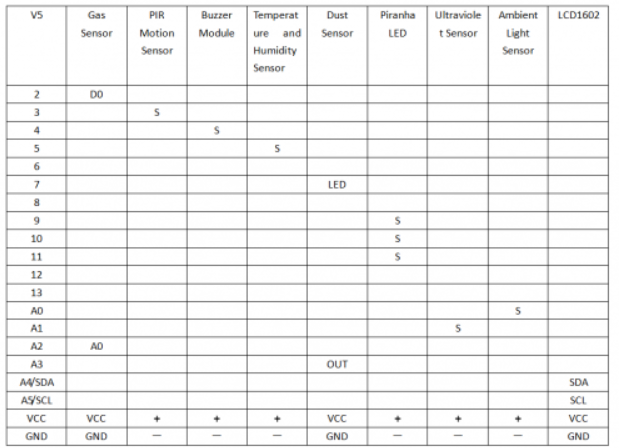
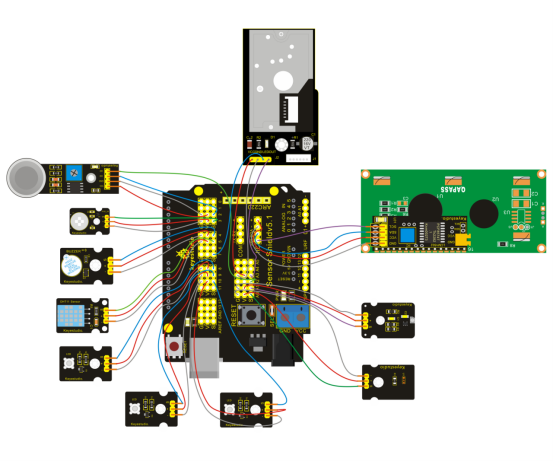
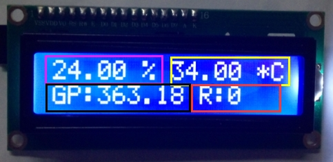

### Project 30 Integrated Project

**1.Introduction** T

 In this project will detect ambient light, ultraviolet ray, gas ,temperature and humidity with LED, buzzer, LCD1602, etc.

**2.Hardware Required**·

- Arduino Board * 1
- Shield V5 *1
- DHT11 Temperature and Humidity Sensor *1
- LCD1602*1
- Piranha LED*3
- TEMT6000 Ambient Light Sensor*1
- GUVA-S12SD 3528 Ultraviolet Sensor*1
- MQ 135 Gas Sensor*1
- GP2Y10 Dust Sensor*1
- Buzzer Module*1
- PIR Motion Sensor*1
- USB Cable*1
- Dupont Line*Several

**3.Circuit Connection**





**4.Sample Code**

```c
#include <Wire.h> 
#include <LiquidCrystal_I2C.h>
#include "DHT.h"
LiquidCrystal_I2C lcd(0x27,20,4);
#define DHTPIN 5     //defining DHT11digital ports
#define GP2Y_LED 7   //defining digital ports of Dust Sensor
#define GP2Y_OUT A3  //defining analog ports of Dust Sensor
#define GAS A2       //defining analog ports of Gas Sensor
#define GAS_D 2     //defining digital ports of Gas Sensor
#define S12SD A1    //defining analog ports of Ultraviolet Sensor
#define TEMT A0     //defining analog ports of Ambient Light Sensor
#define LED1 9      //defining digital ports of LED
#define LED2 10     //defining digital ports of LED
#define LED3 11     //defining digital ports of LED
#define BUZZ 4      //defining digital ports of Buzzer Module
#define PIR 3       //defining digital ports of PIR Motion Sensor
// Uncomment whatever type you're using!
#define DHTTYPE DHT11   // DHT 11 
//#define DHTTYPE DHT22   // DHT 22  (AM2302)
//#define DHTTYPE DHT21   // DHT 21 (AM2301)
float dustVal=0;
int delayTime=280;
int delayTime2=40;
float offTime=9680;
int gasdigi = 1;//original value
boolean IR_val = false; //reading signal in real time of PIR Motion Sensor
int TEMT_val;           //reading signal in real time of TEMT6000Ambient Light Sensor 
int S12SD_val;

DHT dht(DHTPIN, DHTTYPE);

void setup() {
  Serial.begin(9600); 
  dht.begin();

  lcd.init();
  lcd.backlight();
  lcd.clear();
  lcd.setCursor(5,0);
  lcd.print("HELLO");
  delay(1000);
  
  pinMode(GP2Y_LED,OUTPUT);  pinMode(LED1,OUTPUT);pinMode(LED2,OUTPUT);pinMode(LED3,OUTPUT);
  pinMode(BUZZ,OUTPUT);pinMode(PIR,INPUT);pinMode(DHTPIN,OUTPUT);pinMode(GAS_D,INPUT);
  pinMode(GP2Y_OUT, INPUT);pinMode(GAS, INPUT);pinMode(S12SD, INPUT);pinMode(TEMT, INPUT);
  digitalWrite(LED1, LOW);
}

void loop() 
{
    DHT11_FUNC();
    GP2Y_FUNC(); 
    PIR_FUNC();
    TEMT_FUNC();
    S12SD_FUNC();
}

void S12SD_FUNC()
{
  S12SD_val = analogRead(S12SD);
  Serial.println(S12SD_val);
  lcd.setCursor(10,1);
  lcd.print("R:");
  lcd.setCursor(12,1);
  lcd.print(S12SD_val*10);
  if(S12SD_val*10 >= 300)
    digitalWrite(BUZZ,HIGH);
  else
    digitalWrite(BUZZ,LOW);
}

void TEMT_FUNC()
{
  TEMT_val = analogRead(TEMT);
  Serial.println(TEMT_val);
  //analogWrite(LED1, map(analogRead(TEMT), 0 , 1023, 0, 255));
  analogWrite(LED1, map(analogRead(TEMT), 1023 , 0 , 255, 0));
}

void GP2Y_FUNC()
{
  digitalWrite(GAS_D, HIGH);
  digitalWrite(GP2Y_LED,LOW); 
  delayMicroseconds(delayTime);
  dustVal=analogRead(GP2Y_OUT); 
  delayMicroseconds(delayTime2);
  digitalWrite(GP2Y_LED,HIGH); 
  delayMicroseconds(offTime);
   
  if (dustVal>36.455)
  Serial.println((float(dustVal/1024)-0.0356)*120000*0.035);
  lcd.setCursor(0,1);
  lcd.print("GP:");
  lcd.setCursor(3,1);
  lcd.print((float(dustVal/1024)-0.0356)*120000*0.035);
  
  gasdigi = digitalRead(GAS_D);
   if(gasdigi == 0)   digitalWrite(LED3,HIGH);
   else               digitalWrite(LED3,LOW);
}

void DHT11_FUNC()
{
    // Reading temperature or humidity takes about 250 milliseconds!
  // Sensor readings may also be up to 2 seconds 'old' (its a very slow sensor)
  float h = dht.readHumidity();
  float t = dht.readTemperature();
 
  lcd.clear();
  // check if returns are valid, if they are NaN (not a number) then something went wrong!
  if (isnan(t) || isnan(h))
  {
    lcd.setCursor(0,0);
    lcd.print("Failed DHT");
  } 
  else 
  {
    lcd.setCursor(0,0);
    lcd.print(h);
    lcd.setCursor(6,0);
    lcd.print("%");
    
    lcd.setCursor(8,0);
    lcd.print(t);
    lcd.setCursor(14,0);
    lcd.print("*C");
  }
}

void PIR_FUNC()
{
  IR_val = digitalRead(PIR); //reading output of high or low level；
  if(IR_val)
  digitalWrite(LED2,HIGH); //someone moving in detecting rage, LED on；
  else
  //http://keyes-arduino.taobao.com
  digitalWrite(LED2,LOW); //all going well, LED off；
  delay(10); //delaying for some time to make LED stable；
}
```

**5.Result**

After uploading the codes, first you can see the data displayed on LCD1602. Displaying current humidity on top-left, current temperature on top-right; showing dust value on bottom-left, ultraviolet intensity on bottom-right.



LED connected to D9 pin is changing with illumination intensity(the higher the intensity, the brighter the LED).

LED connected to D10 pin is on when someone moving in detecting range. LED connected to D11 pin is on with gas sensor in low level. Sensitivity of the sensor can be adjusted by potentiometer.

After ultraviolet sensor receives ray, read analog value through A1 port. When the value is greater than 300 in the sentence if(S12SD_val*10 >= 300), the buzzer rings.