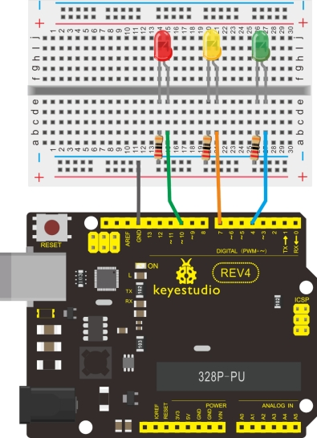

### Project 4 Traffic Light


**1.Introduction** 

In the previous program, we have done the LED blinking experiment with one LED. Now, it’s time to up the stakes and do a bit more complicated experiment-traffic lights. Actually, these two experiments are similar. While in this traffic lights experiment, we use 3 LEDs with different color other than 1 LED.

**2.Hardware Required**

1. Arduino board *1
2. USB cable *1
3. Red M5 LED*1
4. Yellow M5 LED*1
5. Green M5 LED*1
6. 220Ω resistor *3
7. Breadboard*1
8. Breadboard jumper wires* several

**3.Circuit Connection**



**4.Sample Code**
Since it is a simulation of traffic lights, the blinking time of each LED should be the same with those in traffic lights system. In this program, we use Arduino delay () function to control delay time, which is much simpler than C language.

```c
int redled =10; // initialize digital pin 8.
int yellowled =7; // initialize digital pin 7.
int greenled =4; // initialize digital pin 4.

void setup()
{
    pinMode(redled, OUTPUT);// set the pin with red LED as “output”
    pinMode(yellowled, OUTPUT); // set the pin with yellow LED as “output”
    pinMode(greenled, OUTPUT); // set the pin with green LED as “output”
}

void loop()
{
    digitalWrite(greenled, HIGH);//// turn on green LED
    delay(5000);// wait 5 seconds
    digitalWrite(greenled, LOW); // turn off green LED
    for(int i=0;i<3;i++)// blinks for 3 times
    {
        delay(500);// wait 0.5 second
        digitalWrite(yellowled, HIGH);// turn on yellow LED
        delay(500);// wait 0.5 second
        digitalWrite(yellowled, LOW);// turn off yellow LED
    } 
    delay(500);// wait 0.5 second
    digitalWrite(redled, HIGH);// turn on red LED
    delay(5000);// wait 5 second
    digitalWrite(redled, LOW);// turn off red LED
}
```

**5.Result**

When the uploading process is completed, we can see traffic lights of our own design. Note: this circuit design is very similar with the one in LED chase effect.

The blue light will be on for 5 seconds, and then off., followed by the yellow light blinking for 3 times, and then the red light on for 5 seconds, forming a cycle. Cycle then repeats.

Experiment is now completed.  Thank you!