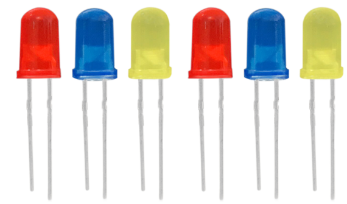
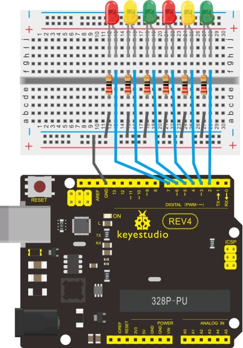

### Project 5 LED Chasing Effect



**1.Introduction**

We often see billboards composed of colorful LEDs. They are constantly changing to form various effects. In this experiment, we compile a program to simulate chase effect.

**2.Hardware Required**

- Arduino Board *1
- USB Cable *1
- Red M5 LED*2 
- Yellow M5 LED*2
- Blue M5 LED*2
- 220Ω Resistor *6 
- Breadboard*1 
- Breadboard Jumper Wires

**3.Circuit Connection**



**4.Sample Code**

```c
int BASE = 2 ;  // the I/O pin for the first LED
int NUM = 6;   // number of LEDs

void setup()
{
   for (int i = BASE; i < BASE + NUM; i ++) 
   {
     pinMode(i, OUTPUT);   // set I/O pins as output
   }
}

void loop()
{
   for (int i = BASE; i < BASE + NUM; i ++) 
   {
     digitalWrite(i, LOW);    // set I/O pins as “low”, turn off LEDs one by one.
     delay(200);        // delay
   }
   for (int i = BASE; i < BASE + NUM; i ++) 
   {
     digitalWrite(i, HIGH);    // set I/O pins as “high”, turn on LEDs one by one
     delay(200);        // delay
   }  
}
```

**5.Result**
You can see the LEDs blink by sequence.