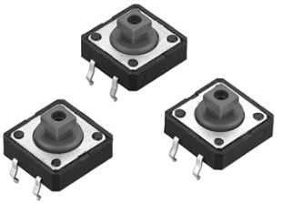
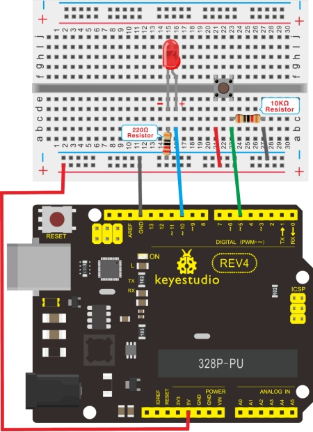

### Project 6 Button-controlled LED



**1.Introduction**

I/O port means interface for INPUT and OUTPUT. Up until now, we have only used its OUTPUT function. In this experiment, we will try to use the input function, which is to read the output value of device connecting to it. We use 1 button and 1 LED using both input and output to give you a better understanding of the I/O function. Button switches, familiar to most of us, are a switch value (digital value) component. When it's pressed, the circuit is in closed (conducting) state.

**2.Hardware Required**

- Arduino Board *1
- USB Cable *1
- Button Switch*1 
- Red M5 LED*1 
- 220Ω Resistor*1
- 10KΩ Resistor*1 
- Breadboard*1
- Breadboard Jumper Wires

**3.Circuit Connection**



**4.Sample Code**
Now, let's begin the compiling. When the button is pressed, the LED will be on. After the previous study, the coding should be easy for you. In this program, we add a statement of judgment. Here, we use an if () statement.

Arduino IDE is based on C language, so statements of C language such as while, switch etc. can certainly be used for Arduino program.

When we press the button, pin 7 will output high level. We can program pin 11 to output high level and turn on the LED. When pin 7 outputs low level, pin 11 also outputs low level and the LED remains off.

```c
int ledpin=11;// initialize pin 11
int inpin=7;// initialize pin 7
int val;// define val

void setup()
{
    pinMode(ledpin,OUTPUT);// set LED pin as “output”
    pinMode(inpin,INPUT);// set button pin as “input”
}

void loop()
{
    val=digitalRead(inpin);// read the level value of pin 7 and assign if to val
    if(val==LOW)// check if the button is pressed, if yes, turn on the LED
    { 
    	digitalWrite(ledpin,LOW);
    }
    else
    { 
    	digitalWrite(ledpin,HIGH);
    }
}
```

**5.Result**
When the button is pressed, LED is on, otherwise, LED remains off. After the above process, the button controlled LED experiment is completed. The simple principle of this experiment is widely used in a variety of circuit and electric appliances. You can easily come across it in your every day life. One typical example is when you press a certain key of your phone, the backlight will be on.