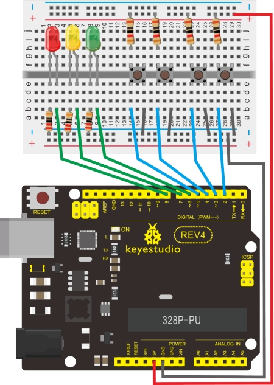

### Project 7 Responder

**1.Introduction**

After completing all the previous experiments, we believe you will find this one easy. In this program, we have 3 buttons and a reset button controlling the corresponding 3 LEDs, using 7 digital I/O pins.

**2.Hardware Required**

- Arduino Board *1
- USB Cable *1
- Button Switch*4 
- Red M5 LED*1 
- Yellow M5 LED*1
- Blue M5 LED*1
- 220Ω Resistor*3
- 10KΩ Resistor*4 
- Breadboard * 1
- Breadboard Jumper Wires

**2.Connection for UNO R3**



**3.Sample Code**

```c
int redled=8;     // set red LED as “output”
int yellowled=7;  // set yellow LED as “output”
int greenled=6;   // set green LED as “output”
int redpin=5;     // initialize pin for red button
int yellowpin=4;  // initialize pin for yellow button
int greenpin=3;   // initialize pin for green button
int restpin=2;   // initialize pin for reset button
int red;
int yellow;
int green;

void setup()
{
    pinMode(redled,OUTPUT);
    pinMode(yellowled,OUTPUT);
    pinMode(greenled,OUTPUT);
    pinMode(redpin,INPUT);
    pinMode(yellowpin,INPUT);
    pinMode(greenpin,INPUT);
}

void loop()  // repeatedly read pins for buttons
{
    red=digitalRead(redpin);
    yellow=digitalRead(yellowpin);
    green=digitalRead(greenpin);
    if(red==LOW)RED_YES();    
    if(yellow==LOW)YELLOW_YES();
    if(green==LOW)GREEN_YES();
}

void RED_YES()// execute the code until red light is on; end cycle when reset button is pressed
{
  while(digitalRead(restpin)==1)
  {
   digitalWrite(redled,HIGH);
   digitalWrite(greenled,LOW);
   digitalWrite(yellowled,LOW);
  }
  clear_led();
}

void YELLOW_YES()// execute the code until yellow light is on; end cycle when reset button is pressed
{
  while(digitalRead(restpin)==1)
  {
  digitalWrite(redled,LOW);
  digitalWrite(greenled,LOW);
  digitalWrite(yellowled,HIGH);
  }
  clear_led();
}

void GREEN_YES()// execute the code until green light is on; end cycle when reset button is pressed
{
  while(digitalRead(restpin)==1)
  {
  digitalWrite(redled,LOW);
  digitalWrite(greenled,HIGH);
  digitalWrite(yellowled,LOW);
  }
  clear_led();
}

void clear_led()// all LED off
{
  digitalWrite(redled,LOW);
  digitalWrite(greenled,LOW);
  digitalWrite(yellowled,LOW);
}
```

